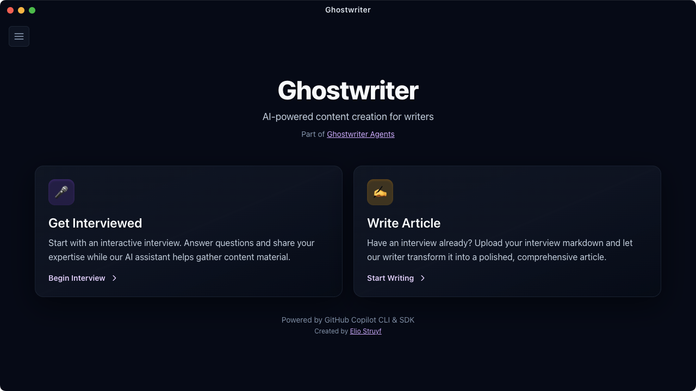

# Ghostwriter App

A test project demonstrating the new
[GitHub Copilot SDK](https://github.com/github/copilot-sdk) for building
AI-powered content creation tools.



## What is Ghostwriter?

Ghostwriter is an AI-assisted content creation application that helps you
transform ideas into polished written content through a two-step process:

1. **Interview Mode**: An AI interviewer asks you targeted questions to gather
   raw material for your content. The conversation adapts to your chosen content
   type (Technical/Tutorial, General/Narrative, Educational/Explainer, or
   Review/Analysis).

2. **Article Writer**: Takes your interview transcript and transforms it into a
   polished, well-structured article. You can optionally provide a voice/style
   guide to ensure the output matches your desired tone and format.

## Features

- **Multi-Turn AI Conversations**: Persistent interview sessions that maintain
  context across page refreshes
- **Multiple AI Models**: Choose from various OpenAI, Anthropic Claude, and
  Google Gemini models (free and premium options)
- **Voice Guide Support**: Upload custom style guidelines to maintain consistent
  tone and formatting
- **Real-time Streaming Articles**: Article generation streams live with a
  5-minute timeout and auto-scroll to the newest text
- **Session Persistence**: Your work is automatically saved to localStorage
- **Modern UI**: Built with Tailwind CSS 4 and Astro 5, with consistent custom
  scrollbars and external links opening in your default browser

## Usage


## How to Use

### Prerequisites

- Node.js 18 or higher
- GitHub Copilot CLI installed and authenticated
- A GitHub Copilot subscription
- GitHub Copilot access configured in your environment

### Install and Authenticate Copilot CLI

1. Install the GitHub Copilot CLI by following the official guide:
   https://docs.github.com/en/copilot/how-tos/set-up/install-copilot-cli
2. Authenticate in your terminal:
  - Open your terminal
  - Run `copilot`
  - At the prompt, run `/login` and complete the browser sign-in flow

### Installation

```sh
npm install
```

### Running the App (Electron + Vite)

```sh
npm run electron:dev
```

This runs Vite at `http://localhost:5173` and launches the Electron shell for
the desktop app.

### Building and Creating a DMG Installer

To create a distributable DMG file for macOS installation:

```sh
npm run electron:build
```

This will:
1. Build the React app for production
2. Compile the Electron main process
3. Create a DMG installer in the `release/` directory

The DMG file can then be distributed to users. They can mount the DMG and drag
the Ghostwriter app to their Applications folder to install it.

**Note**: The first build may take a few minutes as electron-builder downloads
and prepares the necessary components.

### Workflow

1. **Choose Your Mode**:
   - **Get Interviewed**: Start an AI-driven interview to gather content
     material
   - **Write Article**: Convert an existing interview transcript into a polished
     article (button is enabled once you select or import an interview)

2. **Interview Mode**:
   - Select your preferred AI model from the dropdown
   - Answer the interviewer's questions about your content
   - Press Enter to send responses (Shift+Enter for new lines)
   - Type "stop" or "done" to end the interview
   - Click "Generate Transcript" to save your interview

3. **Article Writer Mode**:
   - Upload your interview transcript (markdown file) or select a saved one
   - Optionally upload a voice/style guide
   - Select your preferred AI model
   - Click "Generate Article" to stream the article live
   - Download or copy the final article (auto-scroll keeps the newest text in
     view)

### Model Selection

The app dynamically fetches available AI models from GitHub Copilot. Models are
organized into free and premium (paid) tiers based on your Copilot subscription.

## Tech Stack

- **Framework**: React 18 + Vite
- **Desktop Shell**: Electron 40
- **Styling**: Tailwind CSS 4
- **AI SDK**: GitHub Copilot SDK
- **Markdown Rendering**: Streamdown
- **State**: React hooks + localStorage

## Project Structure

```text
/                  # Project root
├── src/           # Renderer (Vite + React)
│   ├── components/  # UI components (Home, Interview, ArticleWriter, Results)
│   └── styles/      # Global styles
├── electron/      # Main process (Electron) handlers and preload
├── dist-electron/ # Built Electron output
├── assets/        # App assets (icons, screenshots)
├── release/       # Packaged app builds
└── package.json
```

## About This Project

This is an experimental test project built to explore the capabilities of the
new GitHub Copilot SDK. It demonstrates:

- Server-side AI model integration with streaming responses
- Multi-turn conversation management
- Dynamic model selection
- Session persistence across page refreshes
- Integration with multiple AI model families (OpenAI, Anthropic, Google)

The project is based on the
[Ghostwriter Agents](https://github.com/estruyf/ghostwriter-agents-ai) concept,
adapted to use the GitHub Copilot SDK instead of direct API integrations.

## Commands

| Command                   | Action                                                     |
| :------------------------ | :--------------------------------------------------------- |
| `npm install`             | Install dependencies                                       |
| `npm run electron:dev`    | Run Vite dev server and launch Electron shell              |
| `npm run electron:build`  | Build and create a DMG installer for macOS distribution    |
| `npm run electron:build-ts` | Type-check/compile Electron main & preload TypeScript    |

## Learn More

- [GitHub Copilot SDK Documentation](https://github.com/github/copilot-sdk)
- [Ghostwriter Agents Project](https://github.com/estruyf/ghostwriter-agents-ai)
- [Astro Documentation](https://docs.astro.build)

## License

MIT © Elio Struyf

<div align="center">
<a
href="https://visitorbadge.io/status?path=https%3A%2F%2Fgithub.com%2Festruyf%2Fghostwriter-app"></a>
</div>